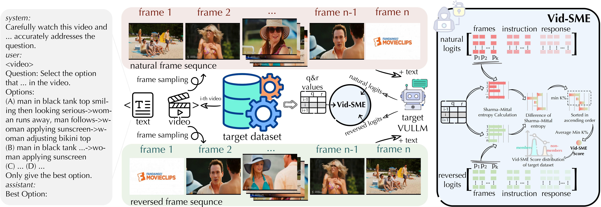

<div align="center">
<h1><a href="https://arxiv.org/abs/2506.03179v1" target="_blank">Vid-SME: Membership Inference Attacks against Large Video Understanding Models</a></h1>


<div>
<a target="_blank" href="https://arxiv.org/abs/2506.03179v1">
  
</a>
</div>

<div>
Qi Li&emsp;Runpeng Yu&emsp;Xinchao Wang<sup>&dagger;</sup>
</div>
<div>
    <a href="https://sites.google.com/view/xml-nus/people?authuser=0" target="_blank">xML-Lab</a>, National University of Singapore&emsp;
    <sup>&dagger;</sup>corresponding author 
</div>
</div>
</div>

------------------
TL;DR (1) - Introduce Vid-SME, the first dedicated method for video membership inference attacks against large video understanding models.

TL;DR (2) - Benchmarking MIA performance by training three VULLMs, each on a distinct dataset, using different representative training strategies.

## Overview

<div align="center">
    <div style="max-width: 100%; text-align: left; margin-bottom: 20px;">
        
    </div>
</div>
<strong>Figure 1.</strong> Vid-SME against Video Understanding Large Language Models (VULLMs). <strong>Left:</strong> An example of the video instruction context used in our experiments. <strong>Middle:</strong> The overall pipeline of Vid-SME. <strong>Right:</strong> The detailed illustration of the membership score calculaiton of Vid-SME.
            
## Installation & Preparation

1. Clone the repo and prepare the virtual environment.

```
git clone https://github.com/LiQiiiii/Neural-Ligand.git
```

```
cd Neural-Ligand
```

```
conda create -n neulig python=3.8.10
```

```
conda activate neulig
```

The codes are tested on torch 2.0.0 and torchvision 0.15.1.

2. Prepare the dataset and models. The download link of the datasets used in the paper can be found in `./data/data_links.txt`. Save them in the `./data` folder. Run:

```
python ./src/finetune_clean.py
```

to get the corresponding models for the training and evaluation.


## Training & Evaluation

```
python ./src/neulig_main.py --num_co_models 2 --global_epoch 1000 --alignment_type sup --model RN50
```

where `--num_co_models` is the number of collaborating models, `--alignment_type` controls the alignment term (i.e., sup/semi), and `--model` controls the model type (i.e., RN50/ViT-B-32/ViT-L-14).

## Citation

If you finding our work interesting or helpful to you, please cite as follows:

```
@misc{li2025multilevelcollaborationmodelmerging,
      title={Multi-Level Collaboration in Model Merging}, 
      author={Qi Li and Runpeng Yu and Xinchao Wang},
      year={2025},
      eprint={2503.01268},
      archivePrefix={arXiv},
      primaryClass={cs.LG},
      url={https://arxiv.org/abs/2503.01268}, 
}
```
